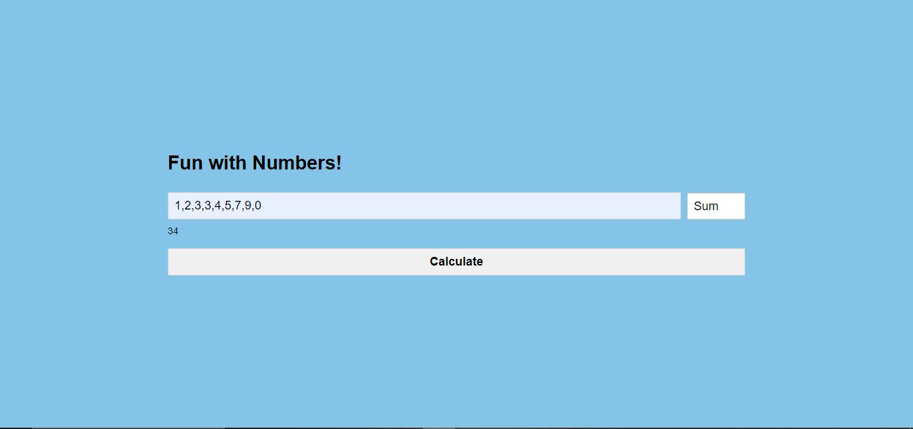

# Fun with Numbers!

## Overview

This project is a simple web application that performs various mathematical operations on a list of numbers provided by the user. The user can enter a comma-separated list of numbers and select an operation to perform from a dropdown menu. The available operations include sum, average, minimum, maximum, median, mode, and range. The logic of this application is written in a switch statement.

## Table of Contents

- [Demo](#demo)
- [Features](#features)
- [Installation](#installation)
- [Usage](#usage)
- [Technologies](#technologies)

## Demo



## Features

- Enter a list of numbers and select an operation to perform.
- Operations include sum, average, minimum, maximum, median, mode, and range.
- Display the result of the selected operation.

## Installation

1. Clone the repository:
    ```sh
    git clone https://github.com/Ckabuo/fun-with-numbers.git
    cd fun-with-numbers
    ```

2. Open the `index.html` file in your web browser.

## Usage

1. Enter a list of numbers separated by commas in the input field.
2. Select an operation from the dropdown menu.
3. Click the "Calculate" button to see the result displayed below.

## Code Explanation

### HTML (`index.html`)

- Contains the basic structure of the web page, including the input field for numbers, the dropdown for selecting operations, and the output display.

### CSS (`index.css`)

- Styles the web page to be visually appealing, with a clean and user-friendly layout.

### JavaScript (`index.js`)

- Handles the logic for the various mathematical operations.
- Listens for the "Calculate" button click, retrieves the input, processes the numbers, and displays the result.

## Technologies

- HTML
- CSS
- JavaScript